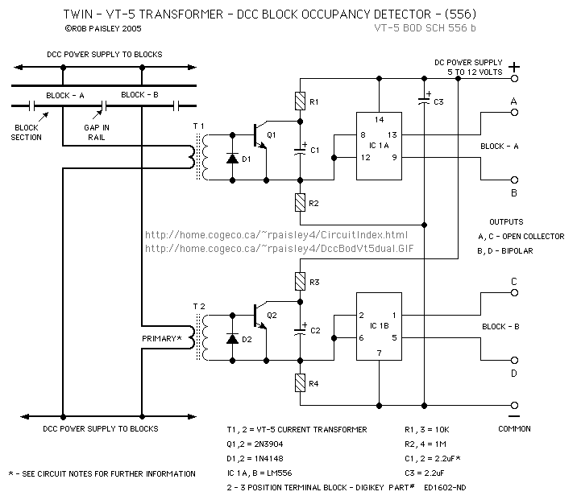
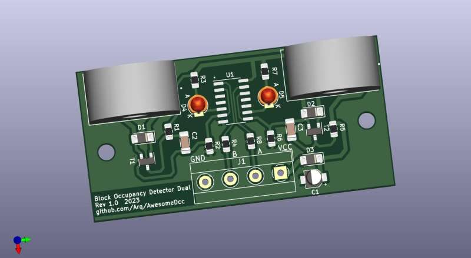

# Block Occupancy Detector Dual
[English Version](README.md)

Projekt blokowego detektora zajętości dla systemów sterowania makietą kolejową.

# Inspiracje
* Rob Paisley
 
[//]: * (http://www.circuitous.ca/CircuitIndex.html) 
 
[//]: # (Rob Paisley non-existing page: http://home.cogeco.ca/~rpaisley4/CircuitIndex.html)
 
  
# Opis
Projekt podwójnego detektor zajętości z przekładnikami prądowymi ZMCT103C z użyciem pojedynczego układu NE556.
Detektor może być stosowany w systemach cyfrowych DCC, charakteryzuje się ą czułością prądową na poziomie 2.7mA AC. 

## Główne cechy
 * Podwójny detektor o wymiarach 60mmx30mm
 * Szeroki zakres napięć zasilania 4.5-16V DC
 * Pobór prądu 14mA-30mA przy 12V
 * Czułość detekcji  2.7mA AC (**tylko systemy DCC**)
 * Wyjścia typu OC (aktywne stanem niskim)
 * Sygnalizacja zajętości  diodami LED 
  
# Projekt
* plik schematu i projekt płytki znajdują się w katalogu **documents**
* Widok 3D (rozmieszczenie elementów)\
 
* Gotowa płytka \
 
* Pliki gerber: [BlockOccupancyDetectorDual-Rev1.0_gerber.zip](./documents/BlockOccupancyDetectorDual-Rev1.0_gerber.zip)

## Lista elementów (BOM)
|#|Reference|Qty|Value|Footprint|
| :--- | :---: | :---: | --- | --- |
|1|C1|1|2.2uF|CP_Elec_3x5.3|
|2|C2, C3|2|1uF|C_1206|
|3|D1, D2, D3|3|TS4148|D_1206|
|4|D4, D5|2|LED|LED_D3.0mm|
|5|R1, R5|2|10k|R_0805|
|6|R2, R6|2|1M|R_0805|
|7|R3, R7|2|2k2|R_0805|
|8|R4, R8|2|220|R_0805|
|9|T1, T2|2|BC817|SOT-23|
|10|Ts1, Ts2|2|ZMCT103C 5A|ZMCT103|
|11|U1|1|NE556|SO-14_3.9x8.65mm_P1.27mm|

