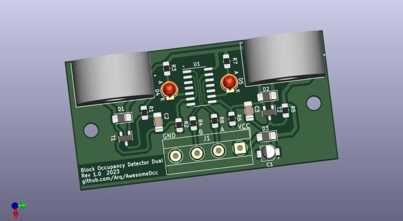
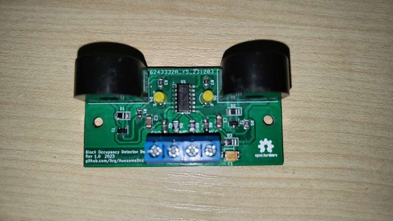

# Block Occupancy Detector Dual 
[Wersja polska](README-PL.md)

Low cost Block Occupancy Detector for Model Railroad 

# Inspiration
 * Rob Paisley
 
[//]: * (http://www.circuitous.ca/CircuitIndex.html) 
 
[//]: # (Rob Paisley non-existing page: http://home.cogeco.ca/~rpaisley4/CircuitIndex.html)
 
  
# Description
Design of a low cost dual, **DCC only**, current sensing block occupancy detector for model railroads.
The "Occupied" signal is logic low. Outputs can be tied to any input ports.

## Key Features
 * Small footprint double detector  60x30mm 
 * Supply voltage 4.5-16V DC
 * Supply current 14mA-30mA @ 12V
 * Minimum current sensitivity  2.7mA AC. 
 * Two outputs open collector type (active low)
 * Detection indication with on board LEDs.

# Design
* See schematic and board files in **documents** folder

* Board 3D View \
 
* Board final \
 
* Gerber files: [BlockOccupancyDetectorDual-Rev1.0_gerber.zip](./documents/BlockOccupancyDetectorDual-Rev1.0_gerber.zip)

## BOM
|#|Reference|Qty|Value|Footprint|
| :--- | :---: | :---: | --- | --- |
|1|C1|1|2.2uF|CP_Elec_3x5.3|
|2|C2, C3|2|1uF|C_1206|
|3|D1, D2, D3|3|TS4148|D_1206|
|4|D4, D5|2|LED|LED_D3.0mm|
|5|R1, R5|2|10k|R_0805|
|6|R2, R6|2|1M|R_0805|
|7|R3, R7|2|2k2|R_0805|
|8|R4, R8|2|220|R_0805|
|9|T1, T2|2|BC817|SOT-23|
|10|Ts1, Ts2|2|ZMCT103C 5A|ZMCT103|
|11|U1|1|NE556|SO-14_3.9x8.65mm_P1.27mm|

